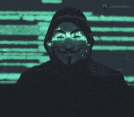

  

# Hello World!, I'm Umer, a Cybersecurity Evangelist 👋🏼:
🛜 👨🏼‍🎓Currently a Cybersecurity Student  👨🏼‍💻 Currently working on my pentesting skills   🎬 Practicing Forensics and Malware Analysis on hacking platforms <i>*CTF PLAYER AT CTFTIME*</i>

# 💻 Tech Stack:
                

<picture>
  <source media="(prefers-color-scheme: dark)" srcset="https://raw.githubusercontent.com/fMavr1ck/output/github-snake-dark.svg" />
  <source media="(prefers-color-scheme: light)" srcset="https://raw.githubusercontent.com/fMavr1ck/output/github-snake.svg" />
  
</picture>
